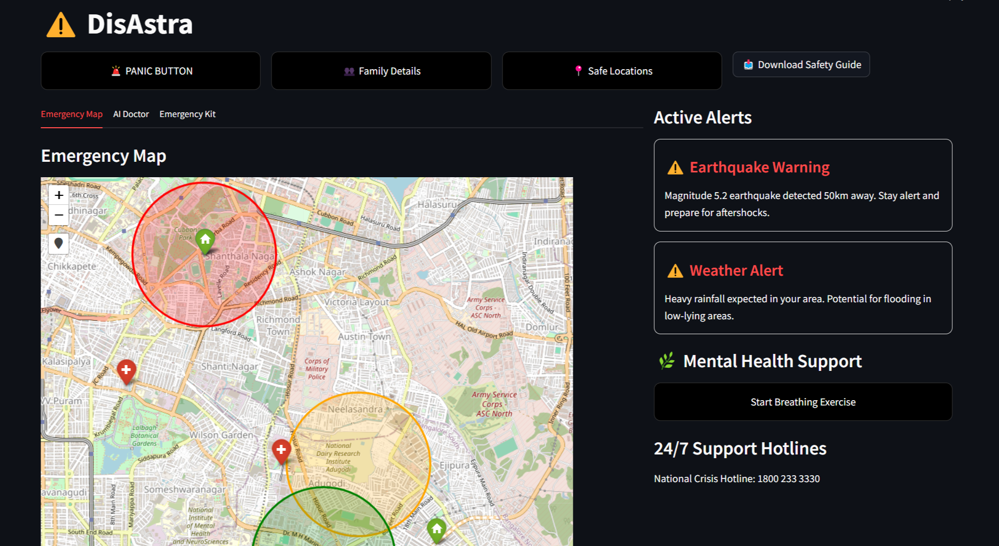

# DisAstra - Real-Time Disaster Management App

**DisAstra** is an innovative web-based platform designed to provide life-saving support during disaster situations. Equipped with advanced technologies like geolocation, AI, and eye-gaze detection, the app delivers real-time safety information, emergency alerts, and critical resources to individuals and families. From identifying safe zones to accessing mental health support, **DisAstra** ensures you are never alone in times of crisis.


## 🖥️ Interface


## ✨ Key Features

- **Emergency Map:** View and track real-time safe zones, shelters, and affected areas.
- **Guardian Eye:** Eye-gaze navigation for hands-free interaction.
- **AI Medical Assistant:** Instant health advice and first aid tips.
- **Panic Button:** One-tap emergency alerts with real-time location sharing.
- **Safe Location Reporting:** Community-sourced safe zones updated dynamically.
- **Family Details Form:** Centralized tracking for family safety.
- **Emergency Kit Checklist:** Track essential items for preparedness.
- **Active Alerts:** Real-time disaster notifications and weather warnings.
- **Mental Health Support:** Guided exercises and crisis hotlines.
- **Downloadable Safety Guide:** Offline access to disaster protocols and tips.

## ⚙️ Technology Stack

- **Frontend:** Streamlit for an intuitive interface.
- **Backend:** SQLite for dynamic data storage.
- **Mapping:** Folium and Geopy for real-time geospatial features.
- **Eye-Gaze Detection:** Camera-integrated computer vision models.
- **AI Chatbot:** Botpress-powered assistant for medical and emergency aid.


## 🔧 Installation Guide

1. Clone the Repository:
   ```bash
   git clone https://github.com/yourusername/disastra.git
   cd disastra
   ```

2. **Install dependencies:**
   - Make sure you have Python 3.x installed on your system.
   - Install required libraries with:
     ```bash
     pip install -r requirements.txt
     ```

3. **Start the Streamlit app:**
   ```bash
   streamlit run app.py
   ```

Once the app is running, open your browser and navigate to `localhost:8501` to start using DisAstra.

---

## 🛠 Key Libraries

- **Streamlit:** For creating the interactive user interface (UI).
- **Folium:** For displaying geospatial maps and disaster zones.
- **SQLite:** For storing data like safe locations, disaster alerts, and reports.
- **Geopy:** To integrate location-based services.
- **Streamlit-Folium:** For embedding Folium maps directly in the Streamlit app.
- **Base64:** For embedding safety guide downloads and other media directly.

---

## 💡 How It Works

### Main Screen
   - Upon launching the app, users are greeted with a clean and intuitive dashboard. From here, they can navigate through options like accessing the panic button, entering family details, and viewing nearby safe locations.
   - Navigation is simple and seamless, with each option clearly laid out for easy use during emergencies.

### Emergency Map
   - The map is centered around your current location and updates in real time.
   - You can zoom in or out to check nearby **safe zones**, **hospitals**, **shelters**, and **disaster areas** marked with color-coded circles that represent different **disaster intensities** (high, medium, low).
   - **Disaster zones** show details such as intensity (e.g., flood, earthquake), while **safe locations** display their type (shelter, medical), capacity, and availability status.

### Guardian Eye
   - Enables hands-free interaction with the app using eye-gaze detection technology.
   - Perfect for situations where users are unable to move or operate their devices manually.
   - Helps send emergency alerts, navigate maps, or access features with just a glance.

### Panic Button
   - In case of an emergency, users can quickly trigger the **panic button**.
   - It instantly shares the user’s current location along with the emergency type (medical, fire, disaster) with local emergency responders.

### AI Medical Assistant
   - Need medical advice or have health concerns? Our AI chatbot provides quick responses to medical queries, helping you make informed decisions during stressful times.
   - Perfect for minor injuries, first aid tips, or medical emergencies where immediate attention is required.

### Safe Location Reporting
   - If you are at a **safe location** or have found one (such as a shelter or medical facility), you can report its details (location, capacity, and type) for others to view.
   - Users can also update the status of reported safe locations, ensuring others know whether the area is available or full.

### Family Details Form
   - In emergencies, it's crucial to have up-to-date contact and location information for your family members.
   - Use the **Family Details Form** to securely record names, locations, and contact info for all family members, ensuring you can reach them quickly during a crisis.

### Emergency Kit Checklist
   - Preparing in advance is key to survival during disasters. With **Emergency Kit Checklist**, you can easily track what you already have and what needs to be packed, like:
     - Water
     - Non-perishable food
     - Flashlights
     - First Aid Kits
     - Emergency blankets
     - And much more!

### Active Alerts
   - DisAstra keeps you up-to-date on ongoing **disaster alerts**.
   - Stay informed about weather warnings, earthquakes, or fire outbreaks, and know exactly when and where to take action.

### Mental Health Support
   - Disasters can be mentally taxing. Use **breathing exercises** to reduce stress and anxiety during intense moments.
   - Reach out to **24/7 mental health crisis hotlines** for support during stressful times.

### Safety Guide Download
   - Access a **pocket-sized safety guide** to have essential emergency information at your fingertips.
   - This guide includes survival tips, disaster prep steps, and first aid instructions.

---

## 👨‍💻 Contributors

This project was created by these amazing developers:

- [Rayyan Khan](https://github.com/Rayyankhan18)
- [Abdul Parveez](https://github.com/Parveez7)
- [Ahad Malik](https://github.com/Ahad-Malik)

---
## 🤝 Contributing

We welcome contributions to make DisAstra even more helpful for users in crisis situations. If you find any issues, have feature ideas, or want to improve existing code, feel free to submit a pull request!

### How to Contribute:
1. **Fork the repository** to your own GitHub account.
2. **Clone the repository** to your local machine.
3. **Create a new branch** for your changes.
4. **Commit your changes** and push them to your forked repository.
5. **Create a pull request** to submit your changes.

---

## 📝 License

This project is licensed under the **MIT License** 

---

_DisAstra_ is designed with your safety in mind, aiming to provide all the tools you need to stay informed and prepared in emergency situations. Together, we can face any disaster, stay safe, and save lives.

**Stay Prepared. Stay Safe. Stay Strong.** 🚨
